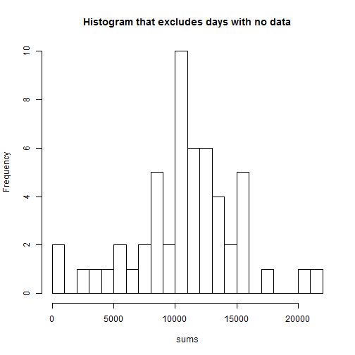
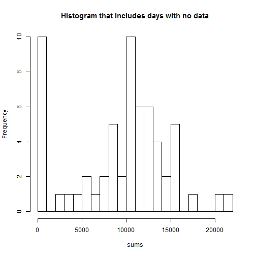
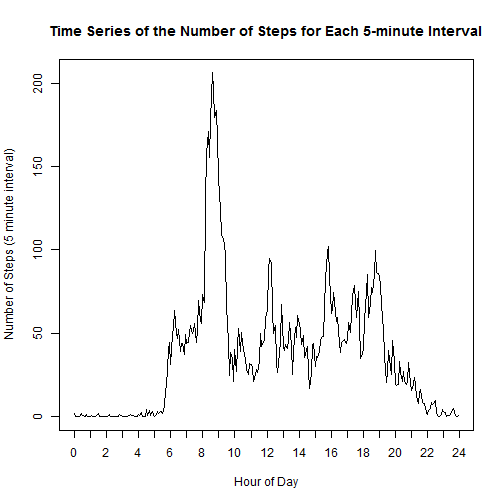
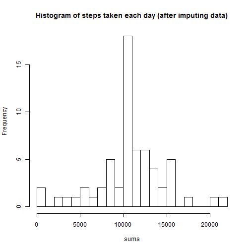
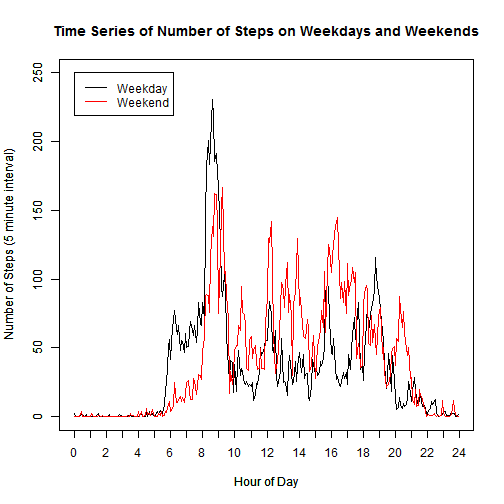
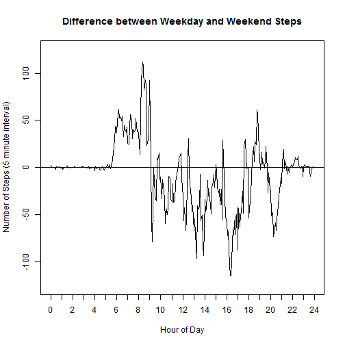

# Peer Assignment 1

## Read data and perform some data processing

Set option to penalize scientific notation.

```r
options(scipen=5)
```

Read activity data file. 

```r
activity <- read.csv("C:/Users/ms8054/Dropbox/activity.csv", stringsAsFactors=FALSE)
summary(activity)
```

```
##      steps           date              interval   
##  Min.   :  0.0   Length:17568       Min.   :   0  
##  1st Qu.:  0.0   Class :character   1st Qu.: 589  
##  Median :  0.0   Mode  :character   Median :1178  
##  Mean   : 37.4                      Mean   :1178  
##  3rd Qu.: 12.0                      3rd Qu.:1766  
##  Max.   :806.0                      Max.   :2355  
##  NA's   :2304
```

Add a factor to the activity data file that measures whether a day is a weekday (Monday-Friday) or a weekend day (Saturday-Sunday)

```r
isWeekday <- function(x) {
  MyDate <- weekdays(as.Date(x, format="%Y-%m-%d"))
  if (MyDate %in% c("Monday", "Tuesday", "Wednesday", "Thursday", "Friday")) {
    weekday <- 1
  } else if (MyDate %in% c("Saturday", "Sunday")) {
    weekday <- 2
  } else { 
    weekday <- NA
  }
  return(weekday)
}
activity$is.weekday <- factor(apply(as.matrix(activity$date), 1, FUN=isWeekday), levels=c(1, 2), labels=c("Weekday", "Weekend"))
```

## What is the total number of steps taken during each day? 


```r
sums <- tapply(activity$steps, list(activity$date), sum, na.rm=TRUE)
```

If a series of missing (NA) values are summed, they sum to zero."
This function identifies dates with at least some valid (non-missing) "steps" data
```

```r
isValid <- function(x) {
  result <- as.numeric(!is.na(x))
  return(sum(result))
}
valid <- tapply(activity$steps, activity$date, isValid)
require(xtable)
```

```r
print(xtable(table(valid)), type="html")
```

<!-- html table generated in R 3.1.1 by xtable 1.7-3 package -->
<!-- Fri Aug 15 17:14:51 2014 -->
<TABLE border=1>
<TR> <TH>  </TH> <TH> valid </TH>  </TR>
  <TR> <TD align="right"> 0 </TD> <TD align="right">   8 </TD> </TR>
  <TR> <TD align="right"> 288 </TD> <TD align="right">  53 </TD> </TR>
   </TABLE>


```r
mean.exclude <- mean(data.frame(valid, sums)[which(valid==288), "sums"])
median.exclude <- median(data.frame(valid, sums)[which(valid==288), "sums"])
mean.noexclude <- mean(sums)
median.noexclude <- median(sums)
```
Excluding days with no data, the mean is 10766 and the median is 10765. 
Including days with no data, the mean is 9354 and the median is 10395.


```r
with(data.frame(valid, sums)[which(valid==288), ],
  hist(x=sums, breaks=30, main="Histogram that excludes days with no data")
)
```

 

```r
with(data.frame(valid, sums),
  hist(x=sums, breaks=30, main="Histogram that includes days with no data")
)
```

 

## Create a time series of steps in each 5 min interval (collapsing across days).

Average the steps in each interval across all days. 

```r
by.interval <- data.frame(as.numeric(names(table(activity[ , "interval"]))), tapply(activity$steps, activity$interval, mean, na.rm=TRUE))
names(by.interval) <- c("interval", "steps")
```


Convert "interval" to minutes (a linear scaling of time) for the time series graph.
The original scaling treated each hour as 100 minutes instead of 60 minutes. 

```r
by.interval$minutes <- (by.interval[ , "interval"] %% 100) + floor(by.interval[ , "interval"]/100)*60
```

Identify the interval with the largest number of steps. 

```r
largest.interval <- by.interval[which(round(max(by.interval$steps) - by.interval$steps, 5) == 0), "interval"]
```
The interval with the largest number of steps is 835. 


```r
with(by.interval,
  plot(x=minutes, y=steps, type="l", xlab="Hour of Day", ylab="Number of Steps (5 minute interval)", xaxt="n", main="Time Series of the Number of Steps for Each 5-minute Interval")
)
axis(side=1, at=c(0:24 * 60), labels=c(0:24))
```

 

## Impute missing data. 

Count of missing and complete values.

```r
require(xtable)
print(xtable(table(is.na(activity[ , "steps"]))), type="html")
```

<!-- html table generated in R 3.1.1 by xtable 1.7-3 package -->
<!-- Fri Aug 15 17:14:51 2014 -->
<TABLE border=1>
<TR> <TH>  </TH> <TH> V1 </TH>  </TR>
  <TR> <TD align="right"> FALSE </TD> <TD align="right"> 15264 </TD> </TR>
  <TR> <TD align="right"> TRUE </TD> <TD align="right"> 2304 </TD> </TR>
   </TABLE>

Merge activity data with interval averages

```r
merged <- merge(x=activity, y=by.interval, by.x="interval", by.y="interval", all=TRUE)
merged <- merged[order(merged$date, merged$interval), ]
```

Replace missing values with interval average

```r
merged[ ,"steps"] <- ifelse(is.na(merged[ ,"steps.x"]), merged[ ,"steps.y"], merged[ ,"steps.x"])
merged$steps.x <- NULL
merged$steps.y <- NULL
```

Compute the total number of steps taken during each day

```r
sums <- tapply(merged$steps, list(merged$date), sum, na.rm=TRUE)
```


```r
mean.total <- mean(sums)
median.total <- median(sums)
```
The mean number of steps taken each day is 10766 and the median number of steps taken each day is 10766. 


```r
 hist(x=sums, breaks=30, main="Histogram of steps taken each day")
```

 

## Create a time series of steps for weekdays and weekend days. 

```r
merged.weekday <- merged[which(merged$is.weekday=="Weekday"), c("minutes", "steps")]
merged.weekend <- merged[which(merged$is.weekday=="Weekend"), c("minutes", "steps")]

weekday <- data.frame(as.numeric(names(table(merged.weekday[ , "minutes"]))), as.numeric(tapply(merged.weekday$steps, merged.weekday$minutes, mean, na.rm=TRUE)))
names(weekday) <- c("minutes", "steps")

weekend <- data.frame(as.numeric(names(table(merged.weekend[ , "minutes"]))), as.numeric(tapply(merged.weekend$steps, merged.weekend$minutes, mean, na.rm=TRUE)))
names(weekend) <- c("minutes", "steps")

with(weekday,
  plot(x=minutes, y=steps, type="l", xlab="Hour of Day", ylab="Number of Steps (5 minute interval)", xaxt="n", ylim=c(0, 250), lty=1, lwd=1.5, col="black")
)
par(new=TRUE)
with(weekend,
  plot(x=minutes, y=steps, type="l", xlab="Hour of Day", ylab="Number of Steps (5 minute interval)", xaxt="n", main="Time Series of Number of Steps on Weekdays and Weekends", ylim=c(0, 250), lty=1, lwd=1.5, col="red")
)
axis(side=1, at=c(0:24 * 60), labels=c(0:24))
legend(x=0, y=250, legend=c("Weekday", "Weekend"), col=c("black", "red"), lty=c(1,1))
```

 

## Bonus graphic:
Calculate the difference between the two time series. When the slopes are steep, this makes it easier to accurately perceive the size of the differences between functions (Cleveland, 1994). 

```r
merged.dif <- merge(x=weekday, y=weekend, by="minutes", all=TRUE)
merged.dif$dif <- merged.dif$steps.x - merged.dif$steps.y
with(merged.dif,
  plot(x=minutes, y=dif, type="l", xlab="Hour of Day", ylab="Number of Steps (5 minute interval)", xaxt="n", ylim=c(-125, 125), lty=1, lwd=1.5, col="black", main="Difference between Weekday and Weekend Steps")
)
axis(side=1, at=c(0:24 * 60), labels=c(0:24))
abline(0, 0)
```

 

## Conclusions:
* We need to be careful about the missing data when calculating the total number of steps per day. Failing to exclude or replace missing data underestimates the mean  number of daily steps by approximately 1,400 and the median number of daily steps by approximately 400. These underestimates are approximately 13% and 3% lower than the true values.
* The histograms show relatively normal distribution of daily walking. However, there are a couple of very low values (even after imputing the missing data). It's possible that those days the person forgot to wear the monitor or there was a technical problem, but without additional information we can't know what really happened. 
* On average, this person takes over 10,000 steps per day. According to http://www.thewalkingsite.com/10000steps.html, that's a lot: approximately 5 miles!
* This person's walking peaks at 8:35 AM. There are a few other small spikes in walking around 12-1 PM and in the early evening, but the morning peak is more than twice as large as any other 5-minute interval. 
* Relative to weekends, there is a spike in walking during early morning and morning commute hours (6-9) on weekdays. This is offset by more walking during the rest of the workday (10-5) on weekends relative to weekdays.
